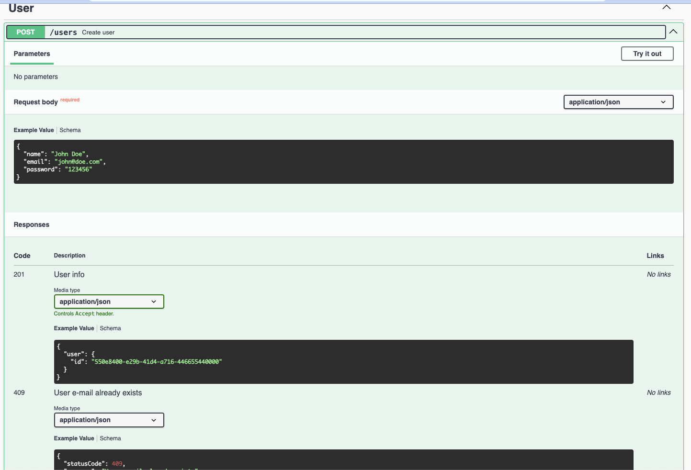

<h1 align="center">
 
  

 
URL-Shortener
</h1>

## Tools
This application features tools backend development!

- 💹 **Nest.js** — A web framework for Node Js
- 📄 **Prisma.io** — ORM that helps app developers build faster and make fewer errors
- 💾 **Postgres** — Automate Your Development Process Quickly Database
- 🗄 **Docker** — Containers Docker
- 📝 **Swagger** — Documentation open API
- 📝 **Jest** — Framework test

## Getting started

1. Clone this repo using `git clone git@github.com:alanhrc/URL-Shortener.git`
2. Move yourself to the appropriate directory: `cd URL-Shortener` 
3. Run `npm install` to install dependencies 

## Start with docker compose
4. The environment preset is development
5. Run `docker compose up` to start database container and server container 

 

 

## Features
### About system

The aim is to build a system that shortens URLs.
Development information:
A project must be implemented with NodeJS in the latest stable version, being built as a REST API. Take into account that the system will be implemented on an infrastructure that scales vertically.
The system must enable user registration and authentication.

- [x] The system must allow a URL sent to be shortened to a maximum of 6 characters. Example:
Entry: https://teddy360.com.br/material/marco-legal-das-garantias-sancionado-entenda-o-que-muda/
Output: http://localhost/aZbKq7;
- [x] Anyone can request that the URL be shortened and to shorten it there must only be one endpoint, but if it is an authenticated user, the system must register that the URL belongs to the user;
- [x] An authenticated user can list, edit the destination address and delete URLs shortened by him.
All access to any shortened URL must be accounted for in the system;
- [x] When a user lists the urls, the number of clicks should appear in the list;
- [x] All records must have a way to know when they have been updated;
- [x] Records can only be logically deleted from the database, that is, there must be a field that stores the date of deletion of the record, if it is null it is because it is valid, if it is filled it is because it was deleted and no reading or writing can be performed by him;
- [x] Build a table structure that makes sense for the project using a relational database;
- [x] Build endpoints for email and password authentication that returns a Bearer Token;
- [x] Build just one endpoint to shorten the URL, it must receive a source URL and must accept requests with and without authentication, it must return the shortened url - including the domain;
- [x] Define what should and should not be an environment variable;

###
Build endpoints that only accept authenticated requests:

- [x] Listing of URLs shortened by the user with click count;
- [x] Update the origin of a shortened URL;
- [x] README or CONTRIBUTING explaining how to run the project;
- [x] Build an endpoint that, upon receiving a shortened URL, redirects the user to the origin URL and counts it;

### Differential

- [x] Use docker-compose to upload the complete environment locally;
- [x] API is documented with OPEN API or Swagger;
- [x] Have input validation everywhere needed;
- [x] Git tags defining release versions, for example release 0.1.0 as shortener created, 0.2.0 as authentication, 0.3.0 as user operations on the shortener, 0.4.0 as access accounting;
- [x] Configure pre commit or pre push hooks;

 ## Next steps and remaining features

- [ ] Code improvements:
- Auth route and functions;
- Validation short URL length;
- Organize and separate code and domains;
- Delete Shortened URL;
- Finalize coverage unit tests;
- 
Part of the tests have been implemented

- [ ] Have observability instrumentation (real implementation or abstraction) of one or more types:
- Logs
- Metrics
- Tracking
- Note: If the implementation is real, it is not mandatory to have it in Docker Compose, when running the application we can insert credentials for services such as Elastic, Sentry, Datadog, New Relic, Open Telemetry, Jagger, Prometheus, etc. as long as it is in variables environment and an explanation of how to configure it. It is also interesting to have an environment variable that activates or deactivates the use of the tool;
- [ ] Deploy it to the environment on a cloud provider and display the link in the readme;
- [ ] Leave points for improvement in the README in case the system needs to scale horizontally and what the biggest challenges will be;
- [ ] Monorepo with separation of services such as identity and access management and URL shortening business rule with communication between services. Mandatory docker-compose in this scenario;
- 
Project SaaS-RBAC Turborepo that I'm finishing

- <a href="https://github.com/alanhrc/SaaS-RBAC" target="_blank">Project SaaS-RBAC Turborepo</a>
- [ ] Configure an api gateway like KrankeD in front of services;
- [ ] Use changelog with the reality of your development;
- [ ] Build Kubernetes deployments for deployment;
- [ ] Build Terraform artifacts for deployment;
- [ ] Build github actions for lint and automated tests;
- [ ] Transform the system into multi-tenant;

 

 

 

 

 

 

 

 
